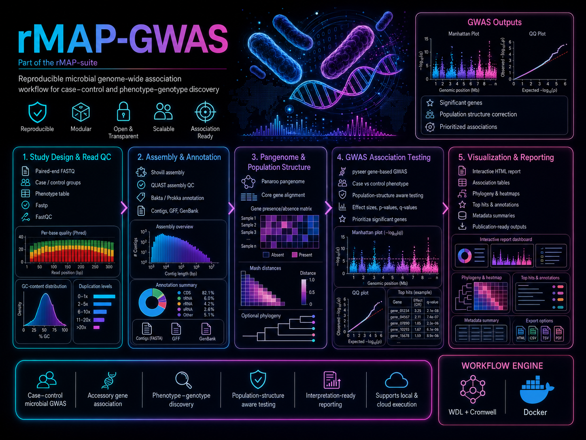

# rMAP-GWAS

**rMAP-GWAS** — **rapid Microbial Analysis Pipeline for Genome-Wide Association Studies** — is a portable WDL/Cromwell workflow for microbial case-control genome-wide association studies from paired-end Illumina reads. It is designed to generate interpretable, reproducible association results with annotated top-priority loci, case/control enrichment, statistical evidence, plots & a self-contained HTML report.

## Workflow overview
<p align="center">
  
</p>
---

## Overview

Microbial genome-wide association studies (mGWAS) can identify bacterial genetic variants, unitigs, genes & accessory-genome features associated with phenotypes such as antimicrobial resistance, virulence, host source, outbreak status, colonization, infection, or clinical outcome. However, microbial GWAS requires careful handling of population structure, case-control imbalance, phenotype quality, feature annotation & reproducible reporting.

`rMAP-GWAS` aims to provide an end-to-end cloud-ready workflow that starts from clearly designated **case** & **control** paired-end reads & produces:

- read QC & trimming summaries
- de novo assemblies
- assembly quality-control metrics
- genome annotation
- pangenome/gene presence-absence matrix
- unitig/k-mer feature matrix
- population-structure correction inputs
- microbial GWAS results using `pyseer`
- annotated significant loci & genes
- case/control enrichment summaries
- Manhattan & QQ plots
- top-priority GWAS hits table
- portable offline HTML report

---

## Intended use cases

`rMAP-GWAS` is designed for microbial isolate datasets where samples can be assigned into two phenotype groups:

- resistant vs susceptible isolates
- invasive vs colonizing isolates
- outbreak vs non-outbreak isolates
- hypervirulent vs non-hypervirulent isolates
- carbapenemase-positive vs carbapenemase-negative isolates
- convergent MDR-hvKp vs non-convergent isolates
- case vs control definitions supplied by the user

The workflow is organism-agnostic in principle, but users should interpret results in the context of species biology, sampling structure, recombination, clonal expansion & phenotype quality.

---

## Key features

- **Case-control aware input design**  
  Users provide separate arrays of case & control paired-end reads in a Cromwell/Terra JSON file.

- **Microbial GWAS engine**  
  Primary association testing is performed using `pyseer`.

- **Feature types supported**
  - unitigs/k-mers
  - pangenome gene presence/absence
  - optional reference-based SNPs when a reference genome & annotation are provided

- **Population-structure correction**  
  The workflow generates distance/covariate inputs to reduce false-positive associations caused by clonal population structure.

- **Annotated top hits**  
  Significant hits are annotated with gene names, products, genomic context, case/control frequencies, enrichment direction, *p*-values, q-values & priority scores.

- **Portable reporting**  
  A final self-contained HTML report summarizes the full analysis & can be shared without requiring external JavaScript, notebooks, or web services.

---

## Workflow structure

```text
rMAP_GWAS
├── VALIDATE_CASE_CONTROL_INPUTS
├── PREPARE_PHENOTYPE_TABLE
├── FASTP_TRIMMING
├── FASTQC
├── MULTIQC
├── ASSEMBLE_GENOMES
├── ASSEMBLY_QC
├── ANNOTATE_GENOMES
├── PANAROO_PANGENOME
├── BUILD_GENE_MATRIX
├── UNITIG_CALLER
├── MASH_DISTANCE_MATRIX
├── PYSEER_UNITIG_GWAS
├── PYSEER_GENE_GWAS
├── optional PYSEER_SNP_GWAS
├── ANNOTATE_SIGNIFICANT_HITS
├── PRIORITIZE_GWAS_HITS
├── MAKE_GWAS_PLOTS
└── MERGE_RMAP_GWAS_REPORT
```

---

## Primary tools

| Stage | Recommended tool |
|---|---|
| Read QC | FastQC |
| Read trimming | fastp |
| QC aggregation | MultiQC |
| Assembly | Shovill or SPAdes |
| Assembly QC | QUAST |
| Genome annotation | Bakta or Prokka |
| Pangenome | Panaroo |
| Unitig generation | unitig-caller |
| Population distance | Mash |
| GWAS engine | pyseer |
| Optional gene-only scan | Scoary |
| Optional SNP workflow | Snippy, bcftools, snpEff/bcftools csq |
| Reporting | Python, pandas, matplotlib, Jinja2 |

---

## Docker/container strategy

The workflow uses public BioContainers, Staph-B, or maintained project images where possible & custom `gmboowa/rmap-gwas-*` images for integration/reporting tasks.

### Public images to use where possible

| Task | Example image |
|---|---|
| fastp | `quay.io/biocontainers/fastp:<tag>` |
| FastQC | `staphb/fastqc:<tag>` |
| MultiQC | `multiqc/multiqc:<tag>` |
| Shovill | `quay.io/biocontainers/shovill:<tag>` |
| SPAdes | `quay.io/biocontainers/spades:<tag>` |
| QUAST | `staphb/quast:<tag>` |
| Panaroo | `quay.io/biocontainers/panaroo:<tag>` |
| unitig-caller | `quay.io/biocontainers/unitig-caller:<tag>` |
| pyseer | `quay.io/biocontainers/pyseer:<tag>` |
| Mash | `quay.io/biocontainers/mash:<tag>` |
| Scoary | `quay.io/biocontainers/scoary:<tag>` |
| Snippy | `staphb/snippy:<tag>` |

### Custom images 

| Image | Purpose |
|---|---|
| `gmboowa/rmap-gwas-pyseer-annotate` | pyseer execution, hit annotation, enrichment summaries, and prioritization |
| `gmboowa/rmap-gwas-report` | final offline HTML report generation |
| `gmboowa/rmap-gwas-bakta-db` | optional Bakta database image or reference bundle |
| `gmboowa/rmap-gwas-reference-bundle:<species-tag>` | optional species-specific reference FASTA/GFF/GenBank resources |

---

## Input JSON example

```json
{
  "rMAP_GWAS.case_sample_names": ["case_001", "case_002"],
  "rMAP_GWAS.case_read1s": ["~/case_001_R1.fastq.gz", "~/case_002_R1.fastq.gz"],
  "rMAP_GWAS.case_read2s": ["~/case_001_R2.fastq.gz", "~/case_002_R2.fastq.gz"],

  "rMAP_GWAS.control_sample_names": ["control_001", "control_002"],
  "rMAP_GWAS.control_read1s": ["~/control_001_R1.fastq.gz", "~/control_002_R1.fastq.gz"],
  "rMAP_GWAS.control_read2s": ["~/control_001_R2.fastq.gz", "~/control_002_R2.fastq.gz"],

  "rMAP_GWAS.phenotype_name": "case_control",
  "rMAP_GWAS.case_label": "case",
  "rMAP_GWAS.control_label": "control",

  "rMAP_GWAS.do_trimming": true,
  "rMAP_GWAS.do_assembly": true,
  "rMAP_GWAS.do_annotation": true,
  "rMAP_GWAS.do_unitig_gwas": true,
  "rMAP_GWAS.do_gene_gwas": true,
  "rMAP_GWAS.do_snp_gwas": false,

  "rMAP_GWAS.reference_fasta": "~/reference.fasta",
  "rMAP_GWAS.reference_gff": "~/reference.gff",
  "rMAP_GWAS.covariates_tsv": "~/covariates.tsv",

  "rMAP_GWAS.min_af": 0.01,
  "rMAP_GWAS.max_af": 0.99,
  "rMAP_GWAS.min_cases": 10,
  "rMAP_GWAS.min_controls": 10,
  "rMAP_GWAS.significance_alpha": 0.05,
  "rMAP_GWAS.max_cpus": 16,
  "rMAP_GWAS.max_memory_gb": 64
}
```

---

## Phenotype encoding

The workflow internally creates a phenotype table:

```text
sample      case_control
case_001    1
case_002    1
control_001 0
control_002 0
```

Interpretation:

```text
positive beta = enriched in cases
negative beta = enriched in controls
```

The final report should always display the phenotype coding used for the analysis.

---

## Main outputs

```text
rMAP_GWAS_report.html
rMAP_GWAS_top_priority_hits.tsv
rMAP_GWAS_all_significant_hits.tsv
rMAP_GWAS_pyseer_unitig_assoc.tsv.gz
rMAP_GWAS_pyseer_gene_assoc.tsv.gz
rMAP_GWAS_gene_presence_absence.Rtab
rMAP_GWAS_gene_presence_absence.csv
rMAP_GWAS_phenotypes.tsv
rMAP_GWAS_population_structure_distances.tsv
rMAP_GWAS_manhattan.svg
rMAP_GWAS_qqplot.svg
rMAP_GWAS_top_hits_barplot.svg
rMAP_GWAS_enrichment_summary.tsv
rMAP_GWAS_run_provenance.json
```

---

## Top-priority hits table

The key interpreted output is:

```text
rMAP_GWAS_top_priority_hits.tsv
```

Recommended columns:

```text
rank
feature_id
feature_type
gene_name
product
contig
position
nearest_gene
case_present
case_total
case_frequency
control_present
control_total
control_frequency
enriched_in
beta
odds_ratio
pyseer_pvalue
q_value
bonferroni_threshold
annotation_source
samples_with_feature
notes
priority_score
```

---

## Enrichment interpretation

A feature is reported as **case-enriched** when:

```text
case_frequency > control_frequency
beta > 0
```

A feature is reported as **control-enriched** when:

```text
control_frequency > case_frequency
beta < 0
```

If the direction from frequencies & model beta disagree, the feature is flagged as:

```text
Check manually
```

---

## Priority scoring

The final report should not rank hits by p-value alone. A suggested priority score is:

```text
priority_score =
  -log10(q_value)
  + abs(log2_odds_ratio)
  + annotation_weight
  + recurrence_weight
```

Suggested weights:

```text
annotation_weight = 2 if feature is inside a named CDS or known AMR/virulence/MGE gene
annotation_weight = 1 if feature is near a gene
recurrence_weight = 1 if feature is present in at least 5 cases or 5 controls
```

Features with very low frequency, poor annotation, or inconsistent enrichment direction should be deprioritized.

---

## HTML report sections

The final `rMAP_GWAS_report.html` should include:

1. Run overview
2. Input cohort summary
3. Case/control balance
4. Read QC and trimming summary
5. Assembly QC summary
6. Annotation and pangenome summary
7. Population structure summary
8. GWAS model summary
9. Manhattan plot
10. QQ plot
11. Top-priority hits
12. Case-enriched hits
13. Control-enriched hits
14. Annotated gene-level associations
15. Annotated unitig/SNP-level associations
16. Warnings and limitations
17. Downloads and provenance

---

## Minimum viable version

The first stable version should implement:

```text
FASTP
FASTQC
MultiQC
Shovill
QUAST
Bakta or Prokka
Panaroo
Mash
unitig-caller
pyseer unitig GWAS
pyseer gene GWAS
hit annotation
priority scoring
portable HTML reporting
```

The reference-based SNP GWAS branch can be added later as an optional module.

---

## Important limitations

Microbial GWAS results can be confounded by:

- clonal population structure
- recombination
- case/control imbalance
- phenotype misclassification
- outbreak overrepresentation
- low sample size
- low-frequency features
- poor genome assemblies
- incomplete gene annotation
- plasmid fragmentation in short-read assemblies

The workflow should warn users when:

```text
number of cases < 10
number of controls < 10
```

The workflow should also issue a caution when:

```text
number of cases < 50 or number of controls < 50
```

because underpowered microbial GWAS can produce unstable associations.

---

## Repository structure

```text
rMAP-GWAS/
├── README.md
├── LICENSE
├── rMAP_GWAS.wdl
├── inputs/
│   ├── example_inputs.json
│   └── example_covariates.tsv
├── docker/
│   ├── rmap-gwas-pyseer-annotate/
│   │   └── Dockerfile
│   └── rmap-gwas-report/
│       └── Dockerfile
├── scripts/
│   ├── validate_inputs.py
│   ├── prepare_phenotypes.py
│   ├── annotate_hits.py
│   ├── prioritize_hits.py
│   ├── make_gwas_plots.py
│   └── build_html_report.py
├── templates/
│   └── rmap_gwas_report_template.html
├── docs/
│   ├── workflow_overview.md
│   ├── input_specification.md
│   └── output_interpretation.md
├── test_data/
│   └── README.md
└── examples/
    └── submission_notes.md
```

---

## Installation & execution

This repository is designed for execution with WDL-compatible engines such as:

- Cromwell
- wdl
- Docker

Example Cromwell command:

```bash
java -jar cromwell.jar run rMAP_GWAS.wdl -i inputs/example_inputs.json
```
---

## Development status

This repository is under active development.

Planned milestones:

- [ ] Create WDL skeleton
- [ ] Add case/control input validation
- [ ] Add phenotype table generation
- [ ] Add read QC & trimming
- [ ] Add assembly & assembly QC
- [ ] Add Bakta/Prokka annotation
- [ ] Add Panaroo gene matrix generation
- [ ] Add unitig-caller feature generation
- [ ] Add Mash distance matrix generation
- [ ] Add pyseer unitig GWAS
- [ ] Add pyseer gene GWAS
- [ ] Add hit annotation & prioritization
- [ ] Add portable HTML report
- [ ] Add test dataset
- [ ] Add Example JSON

---

## Citation

If you use `rMAP-GWAS`, please cite this repository & the core tools used in your analysis. A formal citation will be added once the workflow is released.

Suggested citation format for now:

```text
Mboowa, G. rMAP-GWAS: rapid Microbial Analysis Pipeline for Genome-Wide Association Studies. GitHub: https://github.com/gmboowa/rMAP-GWAS
```

---

## License

This project is released under the MIT License.

---

## Disclaimer

`rMAP-GWAS` is intended for research & surveillance support. GWAS associations require careful interpretation & should be validated using independent datasets, biological evidence & where appropriate, experimental or epidemiological follow-up.
